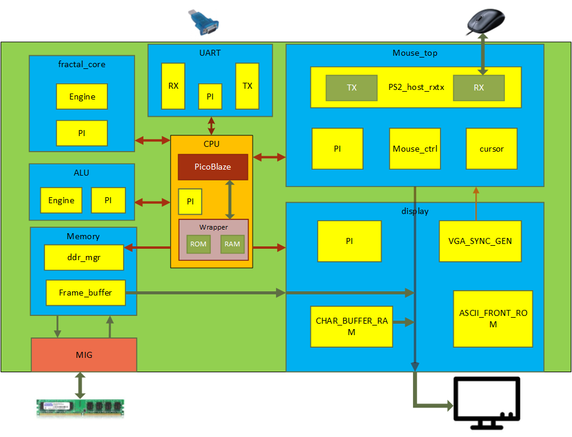

# fractal-fpga

This project realizes a Mandelbrot set fractal accelerator on Xilinx Spartan-3AN board and shows the figure on the monitor through VGA port.  Mouse can select a region for zooming in.

### HW and FW functions:

A PicoBlaze CPU is implemented to 

- Control fractal engine
- Receive mouse activities
- Update parameters shown in screen 
- Handle UART for diagnostics 
- Firmware upload on the fly

RTL modules includes 

- Fractal engine
- VGA display
- DDR2 access
- UART communication 
- Mouse capture via PS2 port. 
- Dedicated ALU for division and multiplication. 

### Architecture

 

 
